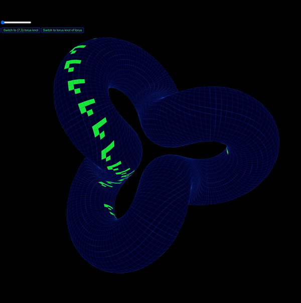
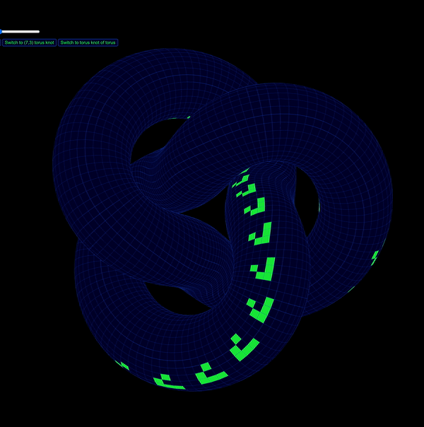
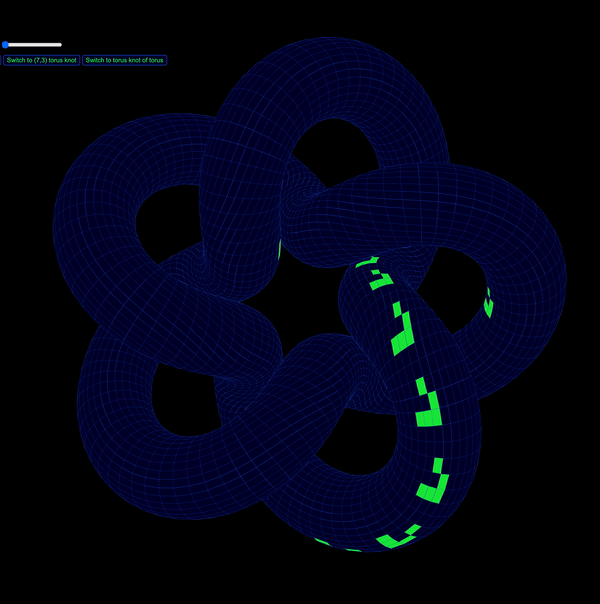
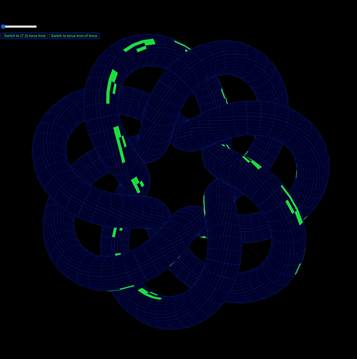
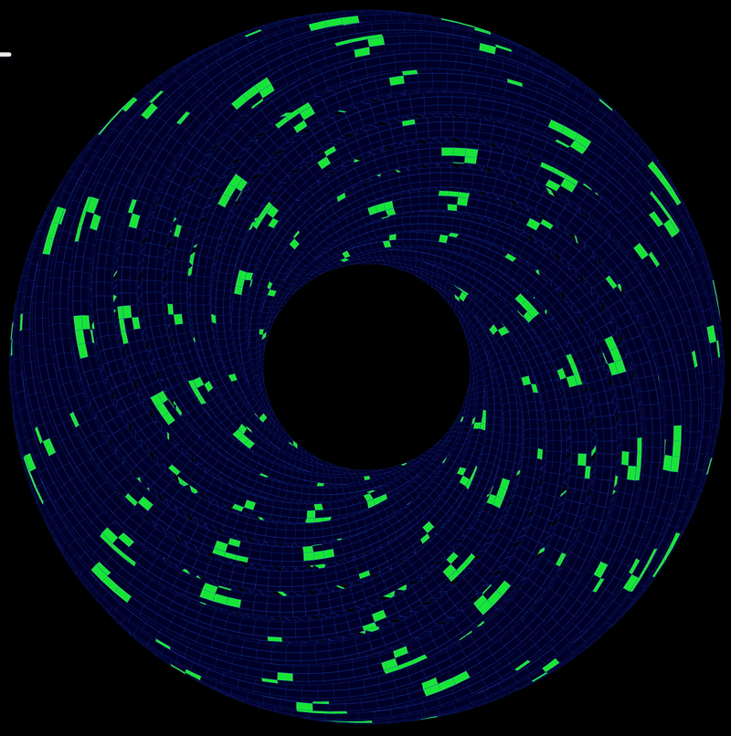

# Knots of Life

Conway's Game of Life simulation on Torus Knots

## Key Features

* Simulate Conway's Game of Life on 5 Different Torus Knots
    - (3,1) Knot
    - Trefoil Knot
    - Solomon's Seal Knot
    - (7,3) Knot
    - Torus Knot of Torus
* Interactive so you can create your own states
* Play, Next, Clear Buttons
* Example state provided
* Speed of simulation controller
* Randomize State provided

## Usage

Check it out at [https://isitusnoamow.github.io/LifeKnot/](https://isitusnoamow.github.io/LifeKnot/)

## Examples

    
    
    

    
    

Going from Left to Right: 
- (3,1) Knot
- Trefoil Knot
- Solomon's Seal Knot
- (7,3) Knot
- Torus Knot of Torus

## Built With

Made using Three.js r59 in order to use Face4 and an older version of OrbitControls